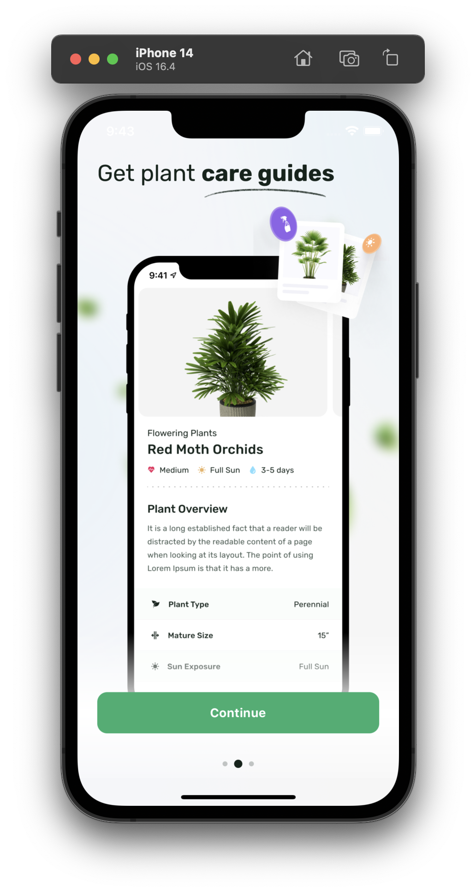

This is a case study for [**HUBX**](https://hubx.co/) company written by Enes Hancer.

# Plant App


- Typescript
- Clean code
- Responsive
- Well-Structured

## Details

This project created with React Native 0.72.6. \
Strict type checking features with elastic coding. \
State management -> redux-toolkit \
API handling -> rtk-query

Reactotron configuration has been set up to easily track state changes in the app. You can download and use it from the website for a smoother and more accurate monitoring experience.
[**Reactotron Releases**](https://github.com/infinitered/reactotron/releases/tag/v2.17.1)

**Note**: If using an Android device or emulator run the following command to make sure it can connect to Reactotron:

```
adb reverse tcp:9090 tcp:9090
```

### Feature-based folder structure:

```
app
|
├── assets
│   ├── docs
│   ├── fonts
│   ├── icons
│   └── images
├── components
│   ├── background
│   ├── box
│   ├── button
│   │   ├── Button.tsx
│   │   ├── button.styles.ts
│   │   └── button.types.ts
│   ├── icon
│   ├── loading
│   └── typo
├── constants
├── features
│   ├── home
│   │   ├── api
│   │   ├── components
│   │   └── screens
│   ├── onboarding
│   └── paywall
├── helpers
├── navigation
├── services
│   ├── api
│   └── redux
└── theme
    ├── index.ts
    ├── fonts.ts
    ├── colors.ts
    ├── sizes.ts
    ├── appStyles.ts
    └── theme.types.ts
```

## Preview

<p float="left">
  
  
  
  
  
</p>


## Getting Started

Follow these steps to get your project up and running:

1. **Clone this repository**

2. **Navigate to the project directory:**
   ```bash
      cd PlantAppHubxEnesHancer
   ```

3. **Install Dependencies**
   ```bash
      npm install
   ```

4. **Install Pods for IOS**
   ```bash
      npx pod-install
   ```

5. **Run the app on an emulator or device:**
   * For iOS:

   ```bash
      npm run ios
   ```

   * For Android:

   ```bash
      npm run android
   ```
6. **You're all set! You can now start building your React Native app.**

## Contributors
   - [Enes Hancer](https://github.com/DeveloperInside)

## Download the Real App
   - [PlantApp](https://plantapp.app/)